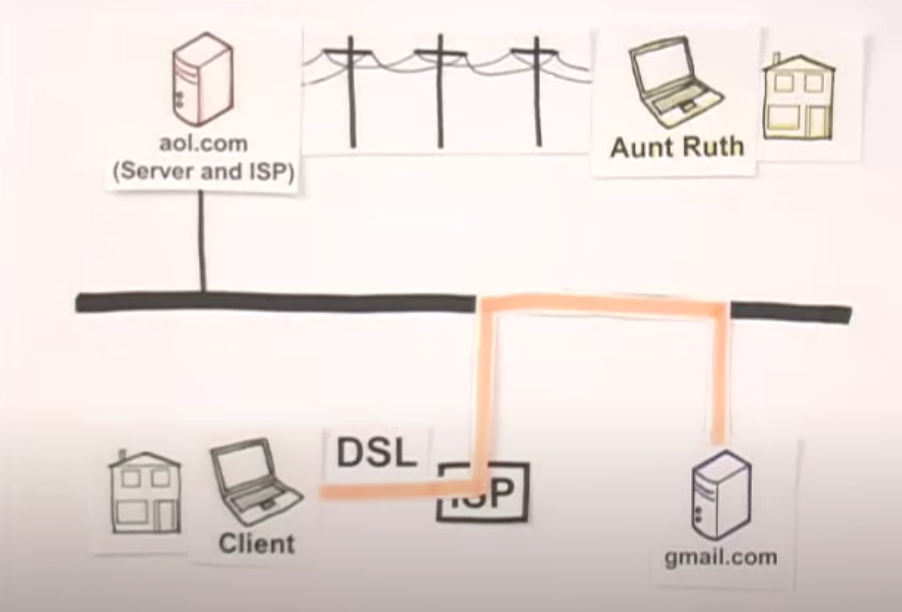

# Como a **Internet** funciona ? 

## O que é internet ? 

O que é a Internet?
De forma simples, a internet é uma rede muito grande que conecta diversos servidores entre si.

Como utilizadores comuns, **nós não estamos ligados diretamente à internet**, mas sim a um provedor de serviços (como uma operadora), que nos conecta a servidores que estão, esses sim, diretamente ligados à internet.

### como recebemos informação do servidor 

A comunicação na internet é feita através do protocolo IP (Internet Protocol). Cada dispositivo na rede tem um **endereço IP**, um identificador único que permite que, ao fazermos uma solicitação a um servidor, ele saiba para onde enviar a resposta.

Essa comunicação segue um caminho: do seu **dispositivo** para o roteador da sua casa, depois para a rede do seu provedor de internet, e daí até o servidor.

### Como internet comunica ?

A internet transmite dados de três formas principais:

- Através de **sinais elétricos** (em cabos de cobre, como o cabo Ethernet)

- Através de **luz** (em cabos de fibra óptica)

- Através de **ondas de rádio** (em redes Wi-Fi ou conexões móveis)

### **DNS**

DNS significa Domain Name System (Sistema de Nomes de Domínio). Quando você digita "youtube.com", o seu computador não entende esse nome diretamente, porque ele só entende endereços numéricos (IP). O papel do DNS é justamente converter nomes como "youtube.com" em endereços IP, que os computadores podem usar para se comunicar com os servidores.

#### Como **dns** faz essa pesquisa ?

Funciona quase como uma “corrente de perguntas”. Se o seu computador não souber o IP de um site, ele pergunta ao servidor **DNS local**. Se esse servidor também não souber, ele pergunta a outros servidores DNS, até encontrar a resposta correta — ou seja, o endereço IP correspondente ao nome digitado.